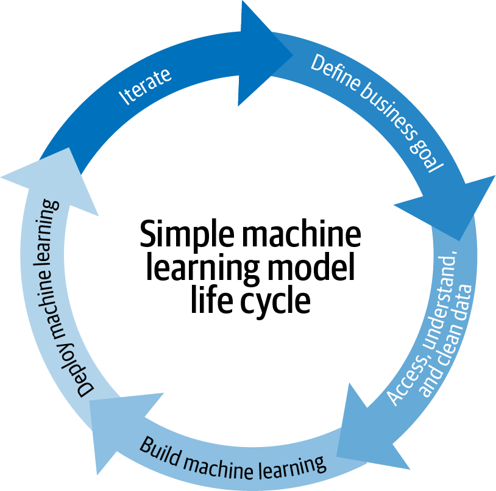

# MLOps란?

# MLOps의 1장 현주소와 당면 과제
---
- MLOps가 AI기업 프로젝트에서 중요한 요소로 떠오르고 있음
- MLOps는 장기적으로 가치를 창출하고 리스크를 줄일 수 있도록 돕는 프로세스임

### MLOps 및 MLOps의 과제 정의
- 여러 머신러닝 모델의 개발과 배포는 최근 생겨난 과제임

- 데이터사이언티스트는 소프트웨어 엔지니어가 아니기 때문에, 대부분 모델 개발과 평가에 특화되어있음
- 지금의 데이터 사이언티스트는 본인 스스로 역할을 조정해야할 필요가 있고, 이런 역할을 철저히 수행하는 것이 어려워 지고 있음

 
 

### 위험 완화를 위한 MLOps
- MLOps는 지속적인 성능 모니터링과 조정이 필수적이기 때문에 제품에 모델이 1개라도 있는 팀이라면 중요성이 대두됌
- 제품에 모델을 사용하는경우 다음과 같은 위험이 발생할 수 있음
    - 특정기간 동안 모델을 사용할 수 없는 위험
    - 모델이 데이터에 대해 잘못된 예측을 반환하는 위험
    - 시간이 지남에 따라 모델의 정확성 또는 공정성이 저하될 위험
    - 모델을 유지하는데 필요한 기술(데이터 사이언티스트)가 사라질 위험
- MLOps 인프라 없이 머신러닝 모델을 제품에 도입하는 건 여러가지 이유로 위험하지만, 제일 중요한 것은 진정한 모델의 성능평가가 제품이 필드에 나갔을 때만 이루어질 수 있기 때문임

 
 

### 책임 AI를 위한 MLOps
- AI의 사용에 대한 책임은 크게 2가지로 볼 수 있음
- 의도성
    - 모델이 목적과 일치하는 방식으로 설계되고 작동하는지
    - 잠재적인 편향을 방지하기 위한 균형적인 학습 방향과 견제가 있어야함
    - 의도성에는 설명가능성(explainable)도 포함함
- 책임
    - 어떤 데이터, 방법, 어떤 모델을 사용하는지 전반적으로 봐야함

### MLOps 확장성

- MLOps는 머신러닝 모델이 제품에 포함될때 리스크를 완화하기 때문에 중요한 것이 아니라 대규모 서비스시 필수적인 요소이기 때문임
- 설계단계의 실험에서 버전관리 추적
- 재교육된 모델이 이전 버전 보다 나은지 여부 이해
